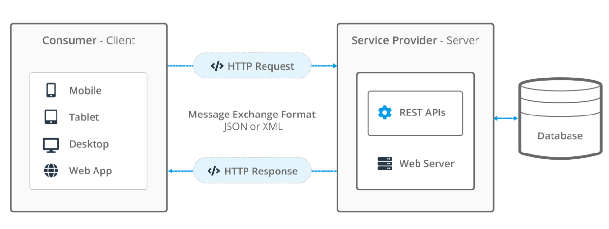

# HỆ THỐNG THI TRẮC NGHIỆM AN TOÀN PT QUIZ

## Nghiên cứu an toàn cho API và ứng dụng xây dựng hệ thống thi trắc nghiệm

## 1. Giới thiệu

PT QUIZ là dự án nghiên cứu và phát triển hệ thống thi trắc nghiệm trực tuyến, tập trung vào việc nghiên cứu API và các giải pháp đảm bảo an toàn thông tin cho hệ thống sử dụng API.

Dự án được thực hiện nhằm mô phỏng môi trường thi trực tuyến trong thực tế, kết hợp giữa ứng dụng Web và ứng dụng Desktop. Hệ thống cho phép người dùng tham gia làm bài thi trắc nghiệm, quản lý dữ liệu bài thi và xử lý thông tin thông qua API trung gian.

Mục tiêu chính của dự án là nghiên cứu các phương pháp thiết kế API an toàn và áp dụng vào việc xây dựng một hệ thống demo phục vụ học tập và nghiên cứu trong lĩnh vực An toàn thông tin.

## 2. Mục tiêu dự án

- Nghiên cứu về API và mô hình lập trình API.
- Phân tích các nguy cơ bảo mật phổ biến đối với API.
- Áp dụng các giải pháp an toàn thông tin vào hệ thống thực tế.
- Xây dựng hệ thống thi trắc nghiệm gồm Web Application và Desktop Application.
- Thiết kế hệ thống đảm bảo tính bảo mật, tính toàn vẹn dữ liệu và kiểm soát truy cập.

## 3. Phạm vi nghiên cứu

Dự án tập trung vào các nội dung:

- Xây dựng API phục vụ giao tiếp giữa các thành phần hệ thống.
- Nghiên cứu cơ chế xác thực và phân quyền.
- Kiểm tra và xử lý dữ liệu đầu vào nhằm đảm bảo an toàn.
- Xây dựng hệ thống thi trắc nghiệm sử dụng API làm trung tâm.

## 4. Kiến trúc hệ thống

Hệ thống được thiết kế theo mô hình client-server với API làm trung gian:

  

Trong đó:

- Web Application và Desktop Application giao tiếp với hệ thống thông qua API.
- API chịu trách nhiệm xử lý logic nghiệp vụ và kiểm soát bảo mật.
- Database lưu trữ dữ liệu người dùng, câu hỏi và kết quả bài thi.

## 5. Công nghệ sử dụng

### Web Application

- PHP
- HTML/CSS
- JavaScript
- Bootstrap

### Desktop Application

- Java
- NetBeans IDE

### API & Backend

- RESTful API
- Xử lý dữ liệu phía server

## 6. Các chức năng chính

### Website (PHP)

- Đăng ký và đăng nhập người dùng
- Hiển thị danh sách bài thi
- Thực hiện bài thi trắc nghiệm online
- Tính điểm tự động
- Quản lý câu hỏi và đề thi
- Giao tiếp với API

### Desktop Application (Java)

- Kết nối API để lấy dữ liệu
- Thực hiện bài thi trên môi trường desktop
- Đồng bộ dữ liệu với server

## 7. Giải pháp an toàn thông tin

Một số kỹ thuật bảo mật được nghiên cứu và áp dụng:

- Xác thực người dùng (Authentication)
- Phân quyền truy cập (Authorization)
- Kiểm tra dữ liệu đầu vào (Input Validation)
- Bảo vệ endpoint API
- Ngăn chặn truy cập trái phép

## 8. Môi trường phát triển

- PHP (Web Server)
- Java (Desktop Application)
- NetBeans IDE
- XAMPP (Apache & MySQL)
